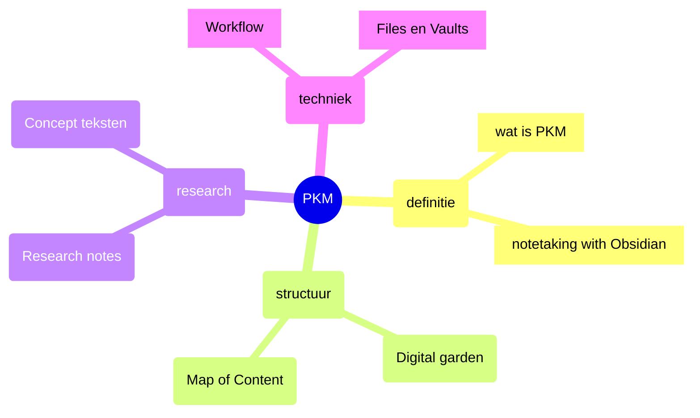

---
{"publish":true,"title":"Mindmaps","created":"2025-12-10","modified":"2025-12-15T16:49:06.090+01:00","cssclasses":""}
---

Wanneer ik een probleem van verschillende kanten wil bekijken en onderzoeken begin ik vrijwel altijd met een [Mindmap](https://en.wikipedia.org/wiki/Mind_map). Er zijn veel goede pakketten om Mindmaps te maken en er zijn Plugins in Obsidian voor. Maar eerlijk gezegd gaat mijn voorkeur uit naar (kleur) potlood en papier. Meerstal maak ik een paar schetsen en die vertaal ik dan uiteindelijk in een notitie per element met Wikilinks voor de verbindingen.

Obsidian biedt, naast een aantal plugins, de mogelijkheid om Mindmaps te genereren vanuit de ingebouwde [Mermaid](https://mermaid-js.github.io/) integratie:

Helaas kan Mermaid (nog) niet Wikilinks opnemen in een mindmap dus in de praktijk is het meestal toch handiger om maar gewoon een de inhoud in tekst met indentatie weer te geven zoals in [[index\|Obsidian praktijktips]]

